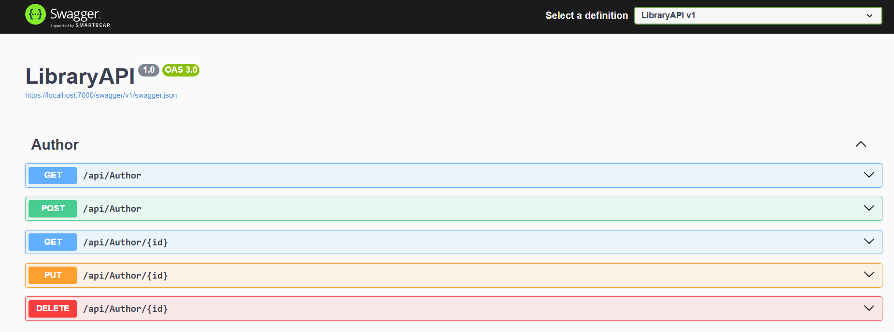
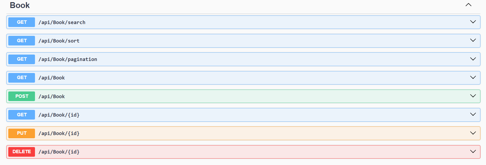
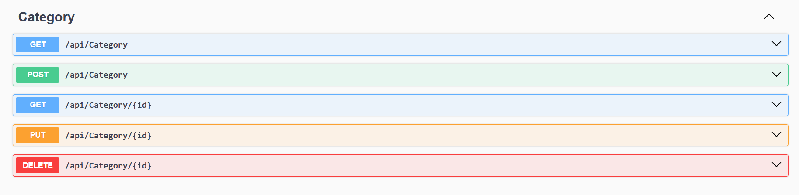

#  Library API 

##  Overview 

Library API is a backend application for managing books, authors, and categories.
It provides CRUD operations and supports searching, sorting, and paginating books.

## Technologies 

- ASP.NET Core 8
- Entity Framework Core
- SQL Server
- AutoMapper
- Swagger
- C#

## Features 

- Manage books, authors, and categories using CRUD operations:
  - Create new records
  - Retrieve records
  - Update existing records
  - Delete records
- Search for books by title
- Sort books by title in ascending or descending order
- Retrieve books using pagination

## API Endpoints 

## What I Learned

## What I Learned

Through this project, I learned how to:

- Build a RESTful Web API using ASP.NET Core.
- Organize backend code into Controllers, Services, Interfaces, DTOs, and Entities.
- Apply separation of concerns by giving each layer a clear responsibility.
- Use Dependency Injection to connect controllers with services.
- Create generic services to reuse common CRUD logic across multiple models.
- Understand how interfaces and generics make the code more reusable and maintainable.
- Use Entity Framework Core to communicate with a SQL Server database.
- Define and work with relationships between books, authors, and categories.
- Use DTOs to control the data sent and received through the API.
- Use AutoMapper to convert between entities and DTOs.
- Implement asynchronous database operations using `async` and `await`.
- Use `AsNoTracking` to improve the performance of read-only queries.
- Build LINQ queries using `Where`, `Contains`, `OrderBy`, `OrderByDescending`, `Skip`, and `Take`.
- Implement case-insensitive book searching by title.
- Sort books by title in ascending or descending order.
- Implement pagination and calculate the number of skipped records using:
  `(pageNumber - 1) * pageSize`.
- Apply a stable order before pagination to ensure consistent results across pages.
- Validate query parameters and reject invalid page numbers or page sizes.
- Work with query parameters using `[FromQuery]`.
- Return appropriate HTTP responses such as `200 OK`, `400 Bad Request`, and `404 Not Found`.
- Understand when an empty result should return an empty list with `200 OK` instead of being treated as an error.
- Understand how LINQ queries are built before being executed with methods such as `ToListAsync`.
- Write project documentation that clearly explains its purpose, technologies, and features.
